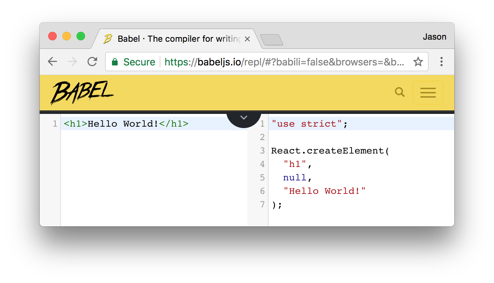

#  Components and JSX


### Learning Objectives
*After this lesson, students will be able to:*
- Identify and define React components
- Describe why we use components in React
- Build a React component
- Describe what JSX is transpiled into

### Preparation
- Have `create-react-app` installed


## Components

The basic unit you'll be working with in ReactJS is a **component**. Components are pieces of our application that we can define once and reuse all over the place.

>**Note!**
>
>For the next day or so, we'll be working with _functional components_. These are lightweight versions of the more robust class-based components we'll see later.
> 
> _**Hint:**_ Functional components are **function**s; regular components are **class**es.   

For an intro to components, watch [this video](https://generalassembly.wistia.com/medias/h64z7lp1ir) (note: right click to open in a new tab!).

If you're used to writing out all of a page's view in a single HTML file, using components is a very different way of approaching web development.

With components, there is more integration and less separation of HTML, CSS, and JavaScript.
- Instead of creating a few large files, you will organize your web app into small, reusable components that encompass their own content, presentation, and behavior.

When using React, building components will be your main front-end task.
- Because they're so encapsulated, components make it easy to reuse your code, test, and separate concerns.

### Identifying Components

Take a look at [CraigsList](https://boston.craigslist.org/search/aap) (note: right click to open in a new tab!).


Each listing is a component. How can you identify this?
- Listings look identical in structure, but have different information populating them
- Listings are dynamically generated based on the user's search

Now, go to [Amtrak.com](https://www.amtrak.com/home) (note: right click to open in a new tab!). We want to look at the listing page, so put in any "From" (for example, New York - Penn Station), any "To" (for example, Boston - South Station), and pick any date. Hit "Find Trains". Now look at the listing page:


Scrolling down it, identify the visual "components" the website is comprised of. We suggest drawing this out on paper! So something like this...


As you're drawing this out, think about the following questions...

* Where do you see "nested components;" that is, where are there components inside another component? Where do you see just one "layer" instead?
* Are there any components that share the same structure?
* For components that share the same structure, what is different about them?


### So -
What does a component look like? Let's start with a simple "Hello World" example...

## Hello World exercise - You do!
#### Code along: A Very Basic Component

In this section, we'll walk through:
* Removing the pre-filled contents of your `hello_world` app.
  - `create-react-app` filled your app with sample content - let's make room for your app!
* Adding your own component definition.
  - You want the app to display the words "Hello World!"
- Going through what we've done in detail!

To start, remove the entire contents of the `src/App.js` file.

Then, add the component definition below - and yes, we know there are no semicolons here. Industry standards for React are to use semicolons as little as possible!
  - With that said, many companies have their own programming style guide. While many companies don't use semicolons in React, some companies do - for example, AirBnB. It's important to check with your company for their practices!

```js
// bring in React from react

import React from 'react';

// define our Hello component
function Hello() {
  // what should the component render?
  // make sure to return some UI
  return (
    <h1>Hello World!</h1>
  );
}

export default Hello;
```

Let's break down the things we see here...

```import React from 'react'```

This imports React methods from the React library.

 ```function Hello```
 
This is the component we're creating. In this example, we are creating a functional component and calling it "Hello."

<!-- ##### `extends Component`

We inherit from the `Component` React library class to create our component definitions. Here, we are creating a new `Component` subclass called `Hello`.
- Because it extends (also known as inherits from) `Component`, our `Hello` class gets to reuse code and capabilities from `React.Component`. -->

```return()```

Every functional component must return _**one**_ jsx tag. This is what renders the component to the screen, (i.e., it controls what is displayed for this component). From this function, we return what we want to display.  
- In our case, we are rendering a "Hello World!" heading: `<h1>Hello World!</h1>`.

> Note! 
> 
> That heading tag above looks like it's straight out of HTML, but it's actually a special language called JSX, which you'll see on the next page. For now, know that JSX will act like HTML when it's rendered to the screen.

```export default Hello```

This exposes the `Hello` class to other files.  This means that other files can `import` from the `App.js` file in order to use the `Hello` class. In our case, we'll be importing it into `index.js` by calling an `import` to `App.js`.

When we try to import something from `App.jsx`, JavaScript will attempt to match a named export.
- Our only named export in `App.jsx` is `Hello`.

The `default` keyword means that if we try to import anything from this file that the app can't find, JavaScript will automatically revert to importing `Hello` instead.
- Only one default export is allowed per file.

### Check it out!

If you switch to your browser and navigate to http://localhost:3000, you can see your "Hello World!" heading. This app dynamically reloads each time you save, so you can check your changes at any point.


### Wait - What's that HTML doing in my Javascript?

This is currently the contents of our `src/App.jsx` file (note the condensed `export` statement):

```js
// bring in React and Component from React

import React from 'react';

// define our Hello component
export default function Hello() {
  // what should the component render?
  // make sure to return some UI
  return (
    <h1>Hello World!</h1>
  );
};

```


### Try it (5 mins)

Let's talk about what this function returns. It looks an awful lot like an HTML heading, but it's not. We often write out React components in **JSX**.

Wait, what's that? Try it yourself:

1. Go here: [Babeljs.io](https://babeljs.io/repl/)
2. Click on "try it out"
1. You should now see a split screen similar to below
3. Paste in `<h1>Hello World!</h1>` in the left panel.
4. You should see the resulting plain javascript on the right.
5. Try any other HTML you might know and see what happens



So, JSX allows us to write code that strongly resembles HTML. It is eventually compiled to lightweight JavaScript objects.

> React can be written without JSX. We won't be doing this, but if you want to learn more, [check out this blog post](http://jamesknelson.com/learn-raw-react-no-jsx-flux-es6-webpack/) (note: open in new tab!).


Your `Hello` component renders:
- Currently returns JSX, not HTML.
- The JSX creates a heading with `'Hello World!'`.
- Your component reads this and renders a "Hello World!" heading.


### Challenge: Greet the day!

- Change your `Hello` component to return multiple lines.
  - Add a line below the "Hello World!" heading that will display `"It is time for tea."` in an `h3`.

> Hint: Remember, the return statement can only return one DOM element. You can, however, place multiple elements within a parent `div` element.
